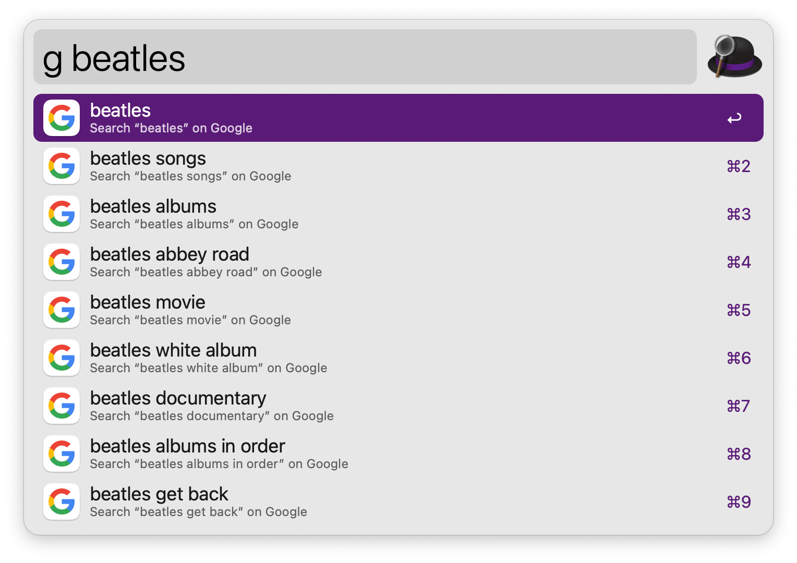

#  Google Suggest Alfred Workflow

Get in-line Google search suggestions

<a href='https://github.com/alfredapp/google-suggest/releases/latest/download/Google.Suggest.alfredworkflow'>⤓ Download Workflow</a>

## Usage

Get in-line suggestions from Google’s search results via the Search Keyword (default: `g`). Press <kbd>⏎</kbd> to open the search results page in the default web browser.

